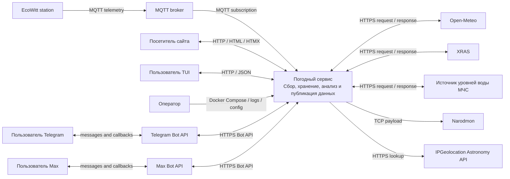

# Системный контекст

**Последняя сверка:** 2026-08-20
**Источники истины:** `cmd/*/main.go`, `pkg/*/client.go`, `internal/telegram/`, `internal/maxbot/`

## Назначение системы

Погодный сервис собирает локальную телеметрию метеостанции EcoWitt, дополняет её внешними прогнозами, геомагнитными и гидрологическими данными, хранит временные ряды и предоставляет их через веб-интерфейс, REST API, терминальный клиент и ботов.

Система отвечает за приём, нормализацию, хранение, агрегацию и публикацию данных. Она не управляет самой метеостанцией, MQTT broker, внешними API и сетями мессенджеров.

## C4 Level 1

Диаграмма показывает логическую границу всего репозитория. Внутри неё находятся несколько independently deployed Go-процессов и общая TimescaleDB; они раскрыты в [контейнерной архитектуре](02-containers.md).

## Акторы

| Актор | Что получает или делает |
|---|---|
| Посетитель сайта | Смотрит текущую погоду, прогноз, историю, архив, рекорды, аналитику, геомагнитные и гидрологические данные; загружает HTMX-фрагменты через browser. |
| Пользователь Telegram | Запрашивает погоду и статистику, управляет подписками, получает события и ежедневные сводки; может работать с фотофункциями бота. |
| Пользователь Max | Запрашивает текущую погоду, управляет подписками, получает события и ежедневные сводки. |
| Пользователь TUI | Читает текущие данные и представления через REST API из терминального клиента. |
| Оператор | Настраивает переменные окружения, выполняет deployment и миграции, наблюдает логи и восстанавливает сервисы. |

## Внешние системы

| Система | Направление относительно сервиса | Назначение |
|---|---|---|
| EcoWitt station и MQTT broker | Входящее | Основной поток локальных погодных измерений. Broker остаётся внешней инфраструктурой. |
| Open-Meteo | Исходящий HTTPS-запрос / входящий ответ | Прогноз погоды для заданных координат. |
| XRAS | Исходящий HTTPS-запрос / входящий ответ | Геомагнитный прогноз и фактические значения Kp. |
| Источник МЧС | Исходящий HTTPS-запрос / входящий ответ | Уровни воды гидрологических постов. |
| IPGeolocation Astronomy API | Исходящий HTTPS-запрос / входящий ответ | Опциональные moonrise/moonset по координатам и дате; при отсутствии клиента используется локальный fallback. |
| Telegram Bot API | Двунаправленное | Long polling/updates, команды, callback, сообщения и фотографии. |
| Max Bot API | Двунаправленное | Long polling, команды, callback и исходящие сообщения. |
| Narodmon | Исходящее | Публикация последних измерений станции. |

## Границы ответственности

Телеметрия становится durable только после успешной записи в `weather_data`. MQTT callback не имеет application queue или replay: malformed payload и ошибка записи логируются, но сообщение может быть потеряно. Система не гарантирует:

- доставку телеметрии до внешнего MQTT broker;
- доступность, полноту и точность сторонних прогнозов;
- доставку сообщения после принятия его API мессенджера;
- доступность сети между production host и внешними системами;
- хранение данных вне PostgreSQL volumes и `photos_data` volume.

Следующие уровни: [контейнеры и процессы](02-containers.md), [интеграции](06-integrations.md), [эксплуатация](08-operations.md).
