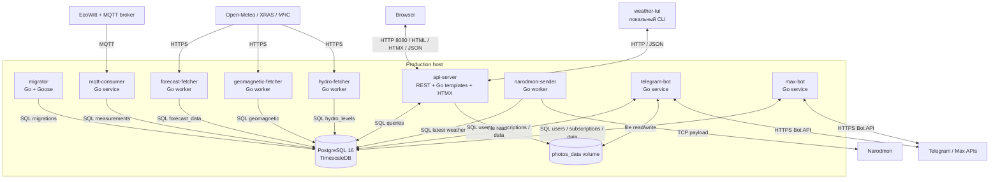

# Контейнеры и процессы

**Последняя сверка:** 2026-08-20
**Источники истины:** `Dockerfile`, `docker-compose.yml`, `docker-compose.prod.yml`, `cmd/*/main.go`

Здесь «контейнер» используется в смысле C4: отдельно запускаемый процесс или хранилище. В production почти каждый Go-бинарник упакован в отдельный Docker image target.

## C4 Level 2

Все прикладные процессы используют одну БД, но не вызывают друг друга по внутреннему RPC. Обмен между ingestion/fetchers, API и ботами проходит через PostgreSQL. Исключения: `weather-tui` вызывает REST API, а `api-server` и `telegram-bot` совместно используют файловый volume фотографий.

## Каталог процессов

| Процесс | Ответственность | Вход | Выход | Состояние | Startup dependency |
|---|---|---|---|---|---|
| `postgres` | Транзакционные данные и временные ряды TimescaleDB | SQL от сервисов | SQL result sets | `postgres_data` | Нет; healthcheck открывает запуск остальных |
| `migrator` | Применяет `migrations/*.sql` через Goose | Файлы миграций, DB config | Изменённая schema | Таблицы Goose в DB | Healthy PostgreSQL |
| `mqtt-consumer` | Парсит MQTT telemetry и сохраняет измерения/сенсоры | MQTT messages | SQL inserts/updates | PostgreSQL | Migrator completed в production |
| `api-server` | REST API, HTML, HTMX partials, static assets и фото | HTTP requests | HTML/JSON/files | PostgreSQL, чтение `photos_data` | Migrator completed в production |
| `forecast-fetcher` | Периодически загружает прогноз | Open-Meteo HTTPS | SQL upsert forecast | PostgreSQL | Migrator completed в production |
| `geomagnetic-fetcher` | Периодически загружает геомагнитные данные | XRAS HTTPS | SQL upsert geomagnetic | PostgreSQL | Migrator completed в production |
| `hydro-fetcher` | Периодически загружает уровни воды | МЧС HTTPS | SQL upsert hydro levels | PostgreSQL | Migrator completed в production |
| `narodmon-sender` | Публикует последние измерения | SQL latest weather | TCP payload в Narodmon; лог отправки | PostgreSQL | Migrator completed в production |
| `telegram-bot` | Обрабатывает updates, команды, фото, подписки и фоновые уведомления | Telegram Bot API, SQL | Telegram messages, SQL, files | PostgreSQL, чтение/запись `photos_data` | Migrator completed в production |
| `max-bot` | Обрабатывает long polling, команды, подписки и уведомления | Max Bot API, SQL | Max messages, SQL | PostgreSQL | Migrator completed в production |
| `weather-tui` | Терминальное представление погодных данных | REST API | Интерактивный terminal UI | Не хранит | Доступный `api-server` |

## Local и production Compose

| Возможность | Local `docker-compose.yml` | Production `docker-compose.prod.yml` |
|---|---|---|
| PostgreSQL | Да; host port настраивается | Да; host port привязан к `127.0.0.1` |
| Migrator | Нет отдельного сервиса | One-shot job перед приложениями |
| MQTT consumer | Да | Да |
| API server | Да | Да |
| Telegram / Max | Да | Да |
| Geomagnetic / hydro fetchers | Да | Да |
| Forecast fetcher | Нет | Да |
| Narodmon sender | Нет | Да |
| TUI | Нет | Нет; запускается вручную |
| Timezone | Наследуется из окружения | Для сервисов задан `Europe/Moscow` |
| Migration dependency | Только DB health | DB health и успешное завершение migrator |

## Сборка образов

Один builder stage компилирует девять Linux-бинарников с `CGO_ENABLED=0`. Отдельные runtime targets копируют только нужный бинарник и runtime assets. `api-server` получает templates/static, `migrator` — SQL migrations, а `telegram-bot` — `exiftool`, Python и HEIC conversion script. `weather-tui` в Dockerfile не собирается.

Подробнее: [внутренние компоненты](03-components.md), [deployment](07-deployment.md), [operations](08-operations.md).
