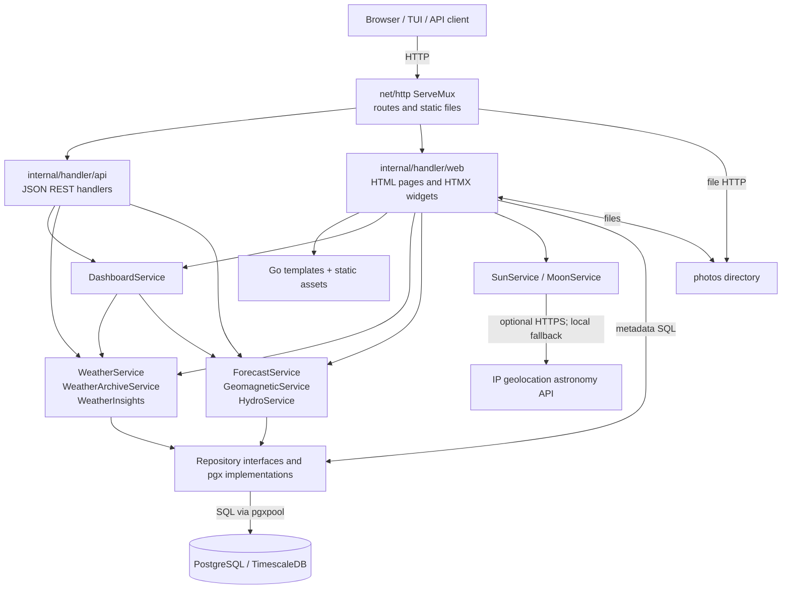
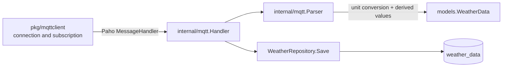
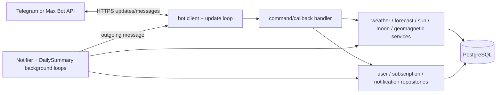

# Внутренние компоненты Go-приложения

**Последняя сверка:** 2026-08-20
**Источники истины:** `cmd/`, `internal/handler/`, `internal/service/`, `internal/repository/`, `internal/models/`, `internal/mqtt/`, `internal/telegram/`, `internal/maxbot/`, `pkg/`

## Основное направление зависимостей

```text
cmd (composition root)
  → transport handlers / workers
    → domain services
      → repository interfaces
        → pgx implementations
          → PostgreSQL / TimescaleDB
```

`cmd/*/main.go` загружает конфигурацию, создаёт pool и concrete dependencies, запускает циклы и обрабатывает shutdown. Бизнес-правила не должны добавляться в composition root.

| Изменение | Правильный слой |
|---|---|
| HTTP route, decode/encode, status code, template response | `internal/handler/api` или `internal/handler/web` |
| Расчёт события, агрегата, архива, dashboard view model | `internal/service` |
| SQL query, upsert, selection policy | `internal/repository` |
| Доменная структура и чистое вычисление | `internal/models` |
| Клиент стороннего HTTP/MQTT/TCP API | `pkg/<integration>` или transport package бота |
| Инициализация и lifecycle процесса | `cmd/<process>/main.go` |

## `api-server`



### Transport layer

- `internal/handler/api` возвращает JSON для dashboard snapshot, weather, sensors и hydro endpoints.
- `internal/handler/web` рендерит полные страницы, detail pages и HTMX widgets. Он также координирует gallery/photo metadata и читает templates.
- `net/http.ServeMux` и route registration находятся непосредственно в `cmd/api-server/main.go`.

### Service layer

- `WeatherService` — текущие/исторические измерения, статистика, события и derived views.
- `WeatherArchiveService` и weather insights — агрегаты и narrative/архивные представления поверх weather repository.
- `DashboardService` композирует weather, forecast, geomagnetic и optional hydro services в snapshot.
- `ForecastService`, `GeomagneticService`, `HydroService` предоставляют доменные чтения своих таблиц.
- `SunService` и `MoonService` выполняют астрономические расчёты; MoonService может использовать внешний client и локальный fallback.

### Repository layer

`internal/repository/interfaces.go` задаёт contracts для weather, sensors, forecast, photos, Narodmon logs, geomagnetic, hydro, Telegram и Max. Concrete pgx repositories содержат SQL. Один `pgxpool.Pool` создаётся в каждом процессе отдельно; межпроцессного shared memory нет.

## MQTT ingestion



Parser принимает URL-encoded или JSON payload, переводит имперские единицы EcoWitt в метрические, вычисляет dew point/feels-like и сохраняет отфильтрованный `raw_data`. Handler логирует parse/save errors и не останавливает subscription loop.

## Боты



Telegram package дополнительно содержит photo/EXIF processing, charts, keyboards и richer command set. Max package использует собственный HTTP client и long polling marker. Таблицы пользователей и уведомлений каналов изолированы друг от друга.

## Осознанные отклонения и границы

- `internal/models` содержит не только DTO, но и чистые weather calculations; это допустимая доменная логика без I/O.
- `DashboardService` и web handler зависят от concrete service structs: композиция проста, но замены обычно требуют constructor changes.
- Bot packages совмещают transport, formatting и фоновые application loops; переносить эту логику в общий abstraction имеет смысл только при реальном третьем канале.
- `internal/apiclient.WeatherService` реализует API-backed access для TUI, но использует `repository.DailyMinMax` в return type. Это небольшой leak repository package в client boundary; новый код не должен расширять такую связь.
- External clients живут преимущественно в `pkg/`, но Telegram и Max clients находятся рядом с channel-specific handlers. Это текущая договорённость, а не основание создавать второй общий client framework.

См. также [потоки данных](04-data-flows.md) и [модель данных](05-data-model.md).
