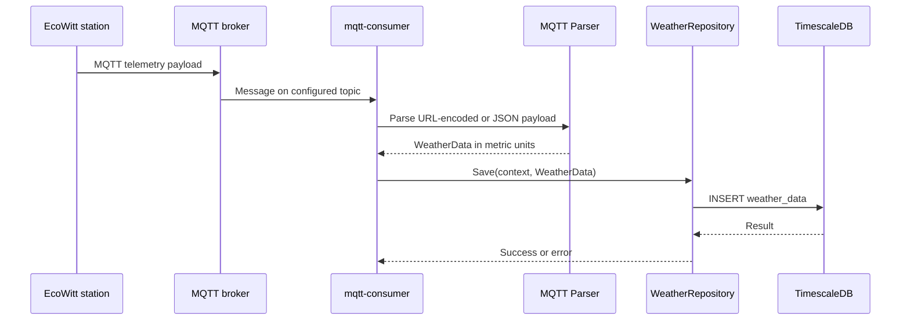
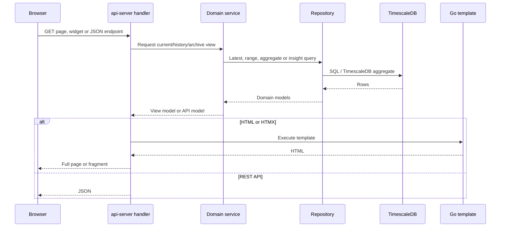
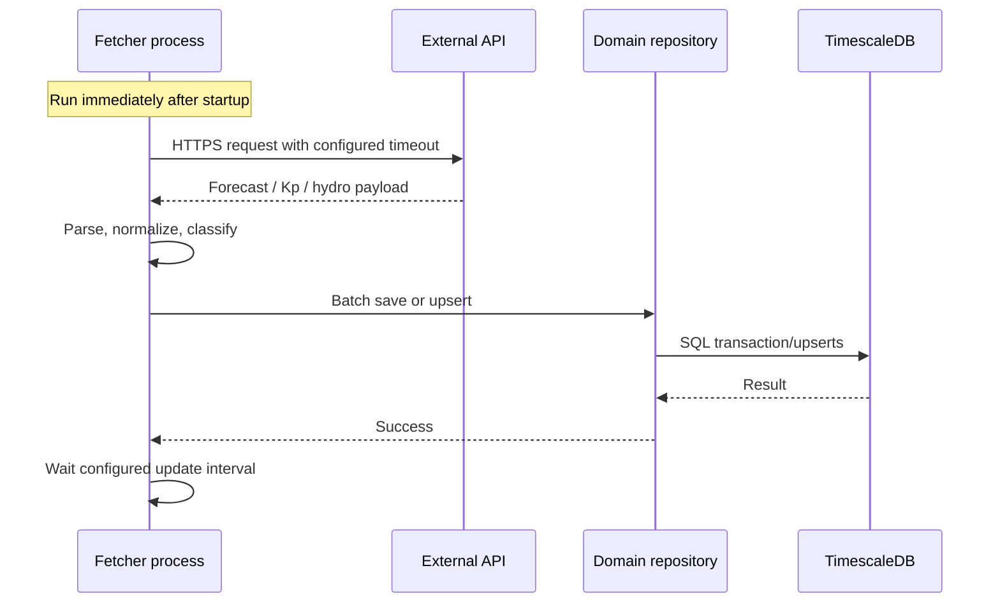
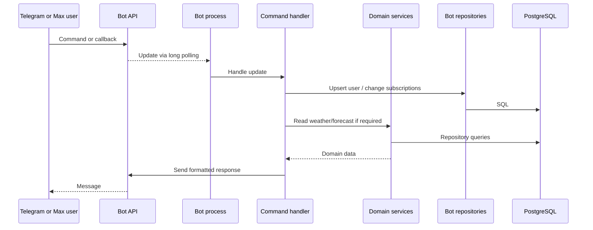
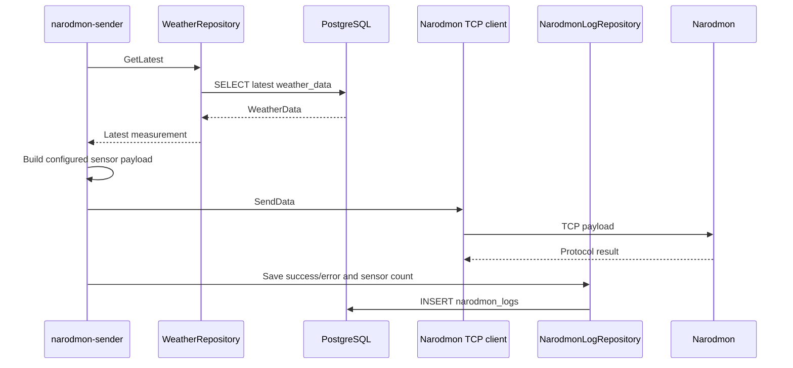

# Основные потоки данных

**Последняя сверка:** 2026-08-20  
**Источники истины:** `cmd/*/main.go`, `internal/mqtt/`, `internal/handler/`, `internal/service/`, `internal/repository/`, `internal/telegram/`, `internal/maxbot/`

## 1. Приём телеметрии EcoWitt

Поток асинхронен относительно пользователей. Время записи назначается parser при обработке сообщения. Parse/save error логируется для конкретного сообщения; MQTT process продолжает работу. Точка durable persistence — `weather_data` hypertable.

## 2. Чтение dashboard и архива

`api-server` выполняет запрос синхронно. Dashboard snapshot может объединять weather, forecast, geomagnetic и hydro reads. Архив выбирает заданный период/разрешение и рассчитывает события поверх доступных станционных данных. Точка чтения — committed rows PostgreSQL; HTTP response не кэшируется отдельным process-local store.

## 3. Обогащение внешними данными

- `forecast-fetcher` загружает hourly/daily Open-Meteo forecast и сохраняет ограниченные конфигурацией горизонты.
- `geomagnetic-fetcher` преобразует XRAS данные в трёхчасовые Kp slots и daily solar activity; после записи удаляет данные старше 90 дней.
- `hydro-fetcher`, если включён, сохраняет metadata гидропостов, actual reading и доступную историю; retention задаётся конфигурацией.

Первый fetch выполняется сразу после подключения к БД. Ошибка внешнего запроса логируется, затем процесс остаётся жив и ждёт следующего tick. Последние успешно сохранённые данные продолжают читаться API и ботами.

## 4. Команда и уведомления ботов

При старте bot process параллельно запускает:

- update loop для команд и callback;
- notifier с конфигурируемым интервалом;
- daily summary scheduler с конфигурируемым временем.

Notifier читает последние погодные события, получает active subscribers, проверяет таблицу notifications для дедупликации, отправляет сообщение и фиксирует факт отправки. Telegram и Max используют отдельные user/subscription/notification tables. Daily summary читает weather, forecast/astronomy/geomagnetic данные, но не создаёт отдельной materialized summary table.

## 5. Публикация в Narodmon

Первая отправка выполняется при старте, затем — по `Narodmon.Interval`. Если измерений нет, process логирует отсутствие данных и ждёт следующего цикла. История результата отправок доступна веб-виджету через `narodmon_logs`.

## Синхронные и асинхронные границы

| Поток | Граница | Durable point | Поведение при ошибке |
|---|---|---|---|
| MQTT ingestion | MQTT callback | `weather_data` insert | Сообщение пропускается, process продолжает subscription |
| HTTP/HTMX read | Один HTTP request | Уже committed DB rows | Handler возвращает ошибку; фоновые процессы не затрагиваются |
| External fetch | Один fetch tick | Batch save/upsert | Сохраняются предыдущие данные; retry на следующем tick |
| Bot command | Один incoming update | User/subscription update | Ошибка логируется/возвращается пользователю; polling продолжается |
| Bot notifier | Один notification cycle | Notification dedup row | Неуспешный cycle повторится согласно notifier logic/interval |
| Narodmon | Один send tick | `narodmon_logs` row | Результат логируется; следующая попытка на следующем tick |

Связанные страницы: [контейнеры](02-containers.md), [компоненты](03-components.md), [интеграции](06-integrations.md).
