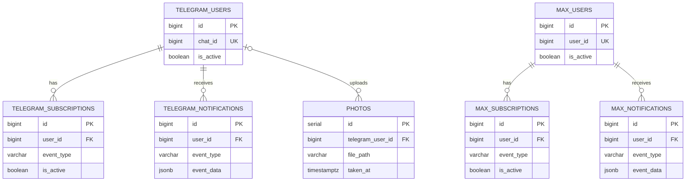

# Логическая модель данных

**Последняя сверка:** 2026-08-20
**Источники истины:** `migrations/001_initial.sql`–`010_create_hydro_levels.sql`, `internal/models/`, `internal/repository/`

PostgreSQL 16 с TimescaleDB — общий источник истины. Schema содержит 15 прикладных таблиц; файлы фотографий находятся вне БД, а таблица `photos` хранит metadata и путь.

## Упрощённая ER diagram

Диаграмма показывает только объявленные foreign keys. Остальные связи логические: `hydro_level_readings.station_uuid` соответствует `hydro_gauges.station_uuid`, а weather snapshot в `photos` копируется по времени съёмки, но FK к `weather_data` нет.

## Домены

| Домен | Таблицы | Владелец записи | Основные читатели |
|---|---|---|---|
| Телеметрия | `weather_data`, `sensors` | `mqtt-consumer`; migrator seed для sensors | API/web, оба бота, Narodmon sender, analytics/archive |
| Forecast | `forecast_data` | `forecast-fetcher` | API/web, Telegram, Max, dashboard service |
| Photos | `photos` + `photos_data` volume | Telegram bot/photo repository | Web gallery, API server, Telegram bot |
| Telegram | `telegram_users`, `telegram_subscriptions`, `telegram_notifications` | `telegram-bot` | Только Telegram application flows |
| Max | `max_users`, `max_subscriptions`, `max_notifications` | `max-bot` | Только Max application flows |
| Geomagnetic | `geomagnetic_kp`, `geomagnetic_daily` | `geomagnetic-fetcher` | API/web, dashboard, оба бота |
| Hydrology | `hydro_gauges`, `hydro_level_readings` | `hydro-fetcher` | API/web, dashboard/hydro services |
| Narodmon audit | `narodmon_logs` | `narodmon-sender` | Web status widget, operator diagnostics |

## Временные ряды TimescaleDB

| Hypertable | Time column | Identity/deduplication | Retention в приложении |
|---|---|---|---|
| `weather_data` | `time` | Временная запись станции; descending time index | Автоматическая retention policy не задана |
| `forecast_data` | `forecast_time` | Unique `(forecast_time, forecast_type)` | Fetcher удаляет прогнозы старше 7 дней |
| `geomagnetic_kp` | `slot_time` | Primary key `(slot_time, source)` | Fetcher удаляет данные старше 90 дней |
| `hydro_level_readings` | `observed_at` | Primary key `(observed_at, station_uuid)` | Количество дней задаёт `Hydro.RetentionDays` |

`weather_data` — wide table: отдельные сенсоры представлены nullable columns, а `sensors` служит каталогом кодов/единиц и не связан FK с каждой записью. `raw_data` сохраняет очищенный JSON исходного сообщения. Миграция `002` добавляет voltage columns `wh65batt` и `ws90cap_volt` в ту же hypertable.

## Остальные time semantics

- `forecast_data.forecast_time` — время, к которому относится forecast; `fetched_at` — время получения.
- `geomagnetic_daily.date` — календарная дата источника, нормализованная без timezone shift.
- `hydro_level_readings.observed_at` — время наблюдения источника; `fetched_at` — время загрузки.
- `photos.taken_at` может происходить из EXIF; `uploaded_at` и `created_at` описывают ingestion.
- Notification tables используют `sent_at` и composite indexes для проверки недавней отправки.
- `narodmon_logs.sent_at` описывает попытку outbound publication.

## Миграции 001–010

| Миграция | Изменение |
|---|---|
| `001_initial.sql` | TimescaleDB extension, `sensors`, `weather_data` hypertable и начальный sensor catalog |
| `002_add_battery_columns.sql` | Voltage fields в `weather_data` |
| `003_telegram_tables.sql` | Telegram users, subscriptions, notification dedup history |
| `004_add_default_daily_summary_subscription.sql` | Data migration: daily summary для существующих active Telegram users |
| `005_create_forecast_data.sql` | Forecast hypertable и unique time/type index |
| `006_create_photos_table.sql` | Photo metadata, Telegram uploader FK и update trigger |
| `007_create_narodmon_logs.sql` | История успешных и неуспешных отправок |
| `008_create_geomagnetic.sql` | Kp hypertable и daily solar activity |
| `009_max_tables.sql` | Max users, subscriptions и notification dedup history |
| `010_create_hydro_levels.sql` | Gauge metadata и hydro readings hypertable |

## Файловые данные

`photos_data` монтируется в `/app/photos` у `api-server` и `telegram-bot`. БД хранит `file_path`, EXIF/Telegram metadata и погодный snapshot, но не бинарное содержимое. Поэтому backup только PostgreSQL недостаточен: volume фотографий должен сохраняться согласованно с таблицей `photos`.

## Владение schema

Только `migrator` должен изменять production schema. Runtime repositories предполагают применённые миграции. Новая таблица требует: SQL migration, model/repository change, обновление этой страницы, container/data-flow docs и backup impact review.
