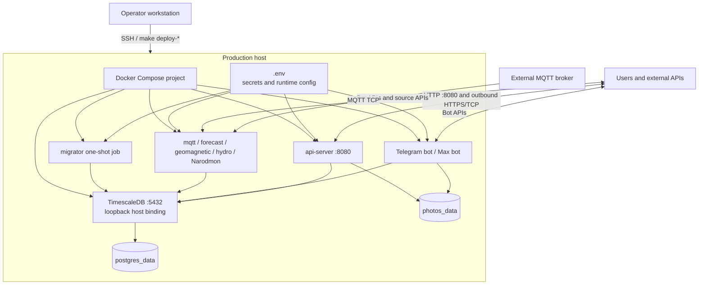

# Deployment и конфигурация

**Последняя сверка:** 2026-08-20  
**Источники истины:** `Dockerfile`, `docker-compose.yml`, `docker-compose.prod.yml`, `.env.example`, `internal/config/config.go`, `pkg/database/postgres.go`, `Makefile`, `DEPLOY.md`, `scripts/deploy.sh`

## Production topology



Compose не содержит reverse proxy/TLS container. `api-server` публикует `${HTTP_PORT:-8080}:8080`; внешний TLS/reverse proxy, если используется, находится вне этого репозитория. PostgreSQL в production доступен на host только через `127.0.0.1:${DB_PORT}`.

## Порядок запуска

1. Compose запускает `postgres`.
2. PostgreSQL healthcheck `pg_isready` должен стать healthy.
3. `migrator` выполняет `/app/migrator up` и завершается с code 0.
4. Все application services имеют dependency `service_completed_successfully` от migrator и `service_healthy` от PostgreSQL.
5. Fetchers и Narodmon sender выполняют initial cycle; боты авторизуются и запускают background loops; API начинает HTTP serving.

Если migrator завершился ошибкой, application containers не должны стартовать. Исправление — устранить причину migration failure и повторить Compose deployment; не обходить dependency ручным запуском старых binaries против новой/частичной schema.

## Local и production

| Аспект | Local Compose | Production Compose |
|---|---|---|
| Назначение | Разработка основных потоков | Полный runtime |
| Migrator | Запускается вручную (`make migrate-up`) | One-shot dependency |
| Workers | Без forecast и Narodmon | Все production workers |
| DB binding | Настраиваемый host port | Только loopback host binding |
| Timezone | Окружение host/container | `Europe/Moscow` для приложений |
| Restart policy | `unless-stopped` у приложений | `unless-stopped`; migrator one-shot |
| Persistent volumes | `postgres_data`, `photos_data` | `postgres_data`, `photos_data` |

`weather-tui` не входит ни в один Compose; он запускается локально и использует `API_URL`.

## Сборка

Dockerfile использует общий Go builder и отдельные Alpine runtime targets. Основные команды:

```bash
make build            # локальная сборка основного набора binaries, включая TUI
make test             # go test -v ./...
make docker-up        # local Compose
make docker-down
make migrate-up
make migrate-status
```

`make build` сейчас не собирает `geomagnetic-fetcher` и `narodmon-sender`; production Docker builder собирает оба. Для локальной проверки этих процессов используйте `go build ./cmd/geomagnetic-fetcher ./cmd/narodmon-sender`.

Production automation:

```bash
make deploy           # scripts/deploy.sh: fetch/reset, build and restart
make deploy-status    # docker compose ps на host
make deploy-logs      # aggregated production logs
make deploy-check     # count и MAX(time) для weather_data
make deploy-db-size
```

Deployment script сохраняет `.env`, `backups/` и `photos/` при очистке server worktree. Источником production-кода является настроенная remote branch.

## Группы конфигурации

`config.Load` сначала читает optional `.env`, затем cleanenv заполняет структуры. Значения `.env` имеют process-wide scope: каждый container получает один и тот же файл, но использует только нужные поля.

| Группа | Компоненты | Основное содержание |
|---|---|---|
| `DB_*` | Все DB-backed процессы | Host, port, database, user/password, SSL mode; pool limits читаются `pkg/database` |
| `MQTT_*` | MQTT consumer | Broker address, credentials, topic, client ID |
| `HTTP_*`, `API_URL` | API server, TUI | Listen address/port и URL REST API |
| `LOCATION_*` | Forecast, API, боты | Координаты и timezone станции |
| `TELEGRAM_*`, `WEBSITE_URL` | Telegram bot | Token, polling/notify intervals, retries, admins, summary time |
| `MAX_*` | Max bot | Token, polling/notify intervals, summary time |
| `FORECAST_*` | Forecast fetcher | Update interval, horizons и HTTP timeout |
| `NARODMON_*` | Narodmon sender/API status | Enable flag, identity, server, interval, timeout, public device URL |
| `ASTRONOMY_*` | API/Telegram MoonService | Optional API key и timeout |
| `GEOMAGNETIC_*` | Fetcher/API/bots | Enable flag, source URL, interval, timeout, threshold, optional proxy |
| `HYDRO_*` | Fetcher/API | Enable flag, endpoint/credentials, station IDs, interval, history, retention |
| `LOG_*` | Все процессы | Level и declared format |

Текущий runtime в основном создаёт `slog.TextHandler` напрямую. `LOG_LEVEL` применяется; `LOG_FORMAT` объявлен, но не переключает handler во всех entrypoints. Операционная документация не должна обещать JSON logs до отдельной реализации.

## Секреты

Обязательная практика:

- создать `.env` из `.env.example` только на доверенном host;
- заменить sample/default password и identity values;
- не коммитить `.env`, `deploy.conf`, tokens и API keys;
- ограничить права чтения `.env` оператором deployment;
- не выводить полный DSN или bot token в логи;
- при компрометации ротировать DB/MQTT credentials и bot/API tokens независимо.

## Persistent data и backup

| Данные | Где находятся | Что резервировать |
|---|---|---|
| SQL schema и rows | `postgres_data` | Регулярный `pg_dump` и проверка restore |
| Фотографии | `photos_data` (`/app/photos`) | Отдельный filesystem/volume backup |
| Конфигурация | Host `.env`, `deploy.conf` | Защищённая копия вне Git |
| Source code | Git remote | Не заменяет backup данных |

Базовые команды DB backup/restore находятся в `DEPLOY.md`. Restore должен выполняться на совместимую schema/version и тестироваться отдельно. Фото и `photos` metadata нужно восстанавливать согласованно; один `pg_dump` не восстанавливает бинарные файлы.

См. [контейнеры](02-containers.md) и [эксплуатационный runbook](08-operations.md).
