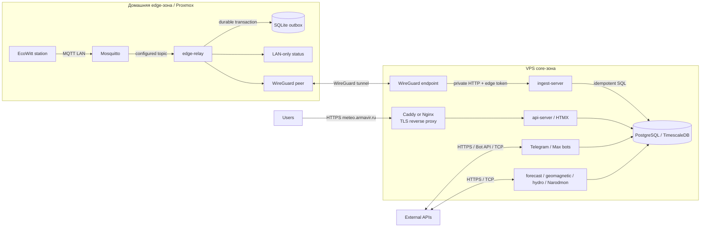
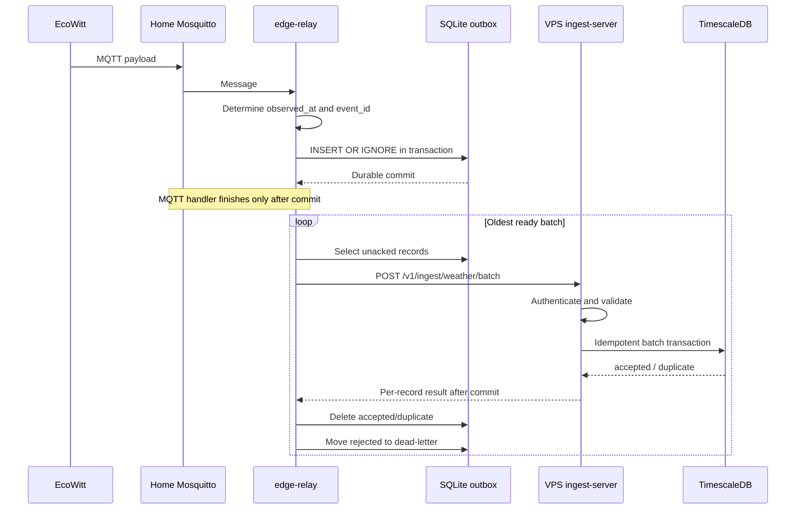

# Home Edge → VPS Architecture Design

**Дата:** 2026-08-20  
**Статус:** Согласовано

## Цель

Перенести публичный погодный сервис, TimescaleDB, ботов и фоновые интеграции на отдельный VPS, оставив EcoWitt и домашний MQTT broker в текущей локальной сети. Система должна переживать до 24 часов отсутствия связи между домом и VPS без потери или искажения времени измерений, а после восстановления автоматически доставлять backlog.

## Принятые решения

- Дом разделяется в отдельную **edge-зону**, VPS — в **core-зону**.
- На домашнем Proxmox остаётся Mosquitto и появляется небольшой `edge-relay` с SQLite outbox.
- На VPS появляется отдельный `ingest-server`; публичный `api-server` не принимает телеметрию.
- Домашний узел сам устанавливает WireGuard tunnel к VPS.
- Ingest endpoint доступен только через WireGuard и дополнительно требует отдельный edge bearer token.
- `meteo.armavir.ru` и TLS переносятся на VPS.
- Домашний статический IP в целевой архитектуре не нужен; его сохраняют только на migration/soak период.
- Локально остаётся только status edge-relay, а не копия полного погодного UI.
- Транспорт имеет at-least-once semantics, storage — idempotent по детерминированному `event_id`.

## Не входит в первый этап

- Полная локальная копия API, UI и TimescaleDB.
- Multi-master или PostgreSQL replication через WAN.
- Prometheus/Grafana/Alertmanager stack.
- Несколько домашних станций и динамическая регистрация edge-узлов.
- Публичный MQTT broker на VPS.
- Открытие PostgreSQL в интернет.

## Системная архитектура



### Домашняя edge-зона

Рекомендуется отдельный LXC/VM на Proxmox, а не установка приложения на hypervisor. Компоненты:

- существующий Mosquitto с persistence, persistent volume и restart policy;
- `edge-relay` как отдельный Go binary/container;
- SQLite database на persistent volume;
- WireGuard peer, инициирующий соединение к статическому endpoint VPS;
- status endpoint, bind только на LAN IP.

### VPS core-зона

На VPS работают:

- WireGuard endpoint;
- `ingest-server`, bind только на WireGuard IP;
- PostgreSQL/TimescaleDB в private Docker network;
- существующие API/HTMX, Telegram, Max и background workers;
- reverse proxy для `meteo.armavir.ru` и ACME TLS.

Ingest endpoint не проксируется через публичный domain. PostgreSQL не публикуется наружу.

## Поток данных



## Событие и исходное время

Текущий MQTT parser назначает `time.Now()` при обработке. Это несовместимо с delayed delivery: после outage архив получил бы время выгрузки, а не измерения.

Новый envelope содержит:

```json
{
  "event_id": "64-character lowercase sha256 hex",
  "edge_id": "home-armavir",
  "station_id": "ecowitt-main",
  "observed_at": "2026-08-20T10:15:00Z",
  "received_at_edge": "2026-08-20T10:15:02Z",
  "payload": "raw MQTT payload"
}
```

Правила:

1. Если EcoWitt payload содержит station timestamp (`dateutc` или подтверждённый аналог), он становится `observed_at`.
2. Иначе используется `received_at_edge`, но никогда время получения на VPS.
3. `event_id = SHA-256(station_id || observed_at || raw payload)`.
4. Одинаковая MQTT-доставка создаёт тот же ID.
5. До реализации нужно подтвердить реальный payload, timestamp field, publish interval, QoS и максимальный размер сообщения.

## SQLite outbox

Минимальная логическая schema:

```sql
CREATE TABLE outbox (
    event_id TEXT PRIMARY KEY,
    station_id TEXT NOT NULL,
    observed_at TEXT NOT NULL,
    received_at_edge TEXT NOT NULL,
    payload BLOB NOT NULL,
    attempts INTEGER NOT NULL DEFAULT 0,
    next_attempt_at TEXT NOT NULL,
    last_error TEXT,
    created_at TEXT NOT NULL
);

CREATE TABLE dead_letter (
    event_id TEXT PRIMARY KEY,
    payload BLOB NOT NULL,
    error_code TEXT NOT NULL,
    error_message TEXT,
    rejected_at TEXT NOT NULL
);
```

SQLite settings:

- WAL mode;
- `synchronous=FULL`;
- bounded busy timeout;
- persistent volume;
- capacity не менее двух измеренных суточных объёмов для требования «24 часа»;
- alerts по queue depth, oldest age и disk usage;
- unacked rows не удаляются по retention.

SQLite — очередь доставки, не долгосрочный архив и не замена VPS backup.

## Uploader

- Берёт oldest ready rows ограниченным batch по count и bytes.
- Отправляет records в порядке `observed_at`, но correctness не зависит от сетевого порядка.
- Удаляет локальные rows только для `accepted` и `duplicate`.
- Перемещает permanent validation failures в dead-letter.
- При timeout, WireGuard outage, network error, HTTP 429 или 5xx сохраняет rows.
- Использует exponential backoff с jitter и cap около пяти минут.
- После восстановления связи постепенно выгружает backlog, не создавая unbounded нагрузку на VPS.

## Ingest API

Endpoint:

```text
POST http://<wireguard-vps-ip>:<ingest-port>/v1/ingest/weather/batch
Authorization: Bearer <edge-token>
Content-Type: application/json
```

Request содержит `edge_id` и массив envelopes. Response возвращает для каждого `event_id`:

- `accepted` — weather row committed;
- `duplicate` — событие уже committed;
- `rejected` — permanent validation error с стабильным `error_code`.

HTTP semantics:

- `200` — batch разобран, per-record results валидны;
- `400` — envelope/batch structurally invalid;
- `401/403` — неверный token или edge/station policy;
- `413` — batch/payload превышает limit;
- `429` — temporary rate limit;
- `5xx` — commit не подтверждён, весь неподтверждённый batch остаётся в outbox.

Success response отправляется только после DB commit.

## Idempotent storage

В `weather_data` добавляются nullable для legacy rows:

- `event_id TEXT`;
- `station_id TEXT`;
- `received_at_edge TIMESTAMPTZ`.

Для новых ingest rows поля обязательны на application boundary. TimescaleDB unique index включает partition key:

```sql
CREATE UNIQUE INDEX weather_data_event_unique
ON weather_data (time, event_id);
```

`ingest-server` выполняет `INSERT ... ON CONFLICT (time, event_id) DO NOTHING` и по affected rows различает `accepted`/`duplicate`. Raw payload продолжает проходить через общий EcoWitt parser, чтобы unit conversion и derived values не дублировались между direct и batch ingestion.

## Безопасность

- WireGuard server — на VPS со статическим public endpoint.
- Домашний peer инициирует tunnel и использует `PersistentKeepalive`.
- `ingest-server` bindится только на VPN address.
- Firewall разрешает ingest port только из WireGuard subnet.
- Отдельный edge token хранится в env обоих узлов и сравнивается constant-time.
- Token ротируется независимо от WireGuard keys.
- Edge ID привязан к допустимым station IDs.
- Ограничиваются batch count, total bytes и payload bytes.
- Ошибки не логируют bearer token и полный sensitive payload.
- PostgreSQL доступен только внутри VPS private network.

## Статический IP и DNS

Целевая схема не требует статического домашнего IP:

- WireGuard endpoint находится на VPS;
- домашний peer всегда инициирует outbound tunnel;
- смена домашнего IP и CGNAT не нарушают модель;
- inbound port forwarding дома не нужен;
- `meteo.armavir.ru` указывает только на VPS.

Статический домашний IP сохраняется на migration/soak период 1–2 недели как rollback option. После подтверждённой стабильности его можно отключить. Он не помогает при outage домашнего интернета и не заменяет outbox.

## Failure model

| Сбой | Поведение |
|---|---|
| Домашний интернет/WireGuard недоступен | MQTT сохраняется в SQLite, uploader retry с backoff |
| VPS/ingest-server недоступен | Outbox растёт, основной локальный ingestion продолжается |
| Edge restart | WAL/outbox сохраняются, отправка продолжается с oldest row |
| VPS restart/timeout после commit | Batch повторяется, unique index возвращает duplicate |
| Невалидный payload | Dead-letter, следующие события продолжают обрабатываться |
| Edge disk близок к заполнению | LAN status/alert; unacked rows не удаляются молча |
| Mosquitto недоступен | Relay не может сохранить неполученное сообщение; требуется broker persistence/restart и проверка station QoS |
| Token invalid | 401/403, outbox сохраняется, operator alert |

## Наблюдаемость

LAN-only edge status показывает:

- MQTT connected;
- WireGuard/ingest reachability;
- queue depth и bytes;
- oldest queue age;
- last MQTT receive;
- last successful upload;
- accepted/duplicate/rejected/retry counters;
- dead-letter count;
- last error;
- disk usage.

VPS контролирует freshness по `MAX(weather_data.time)`/station, ingest error rate и backlog age, передаваемый relay. Если данных нет дольше threshold, VPS отправляет alert. Публичный `meteo.armavir.ru` контролируется внешним uptime monitor.

## Проверка

### Discovery

Перед кодом снять с реального broker:

- sample payload без секретов;
- source timestamp field и формат;
- publish QoS;
- средний/максимальный payload size;
- сообщения в минуту/сутки;
- поведение при restart relay и broker;
- текущие Mosquitto persistence/queue settings.

### Unit tests

- deterministic `event_id`;
- parsing source timestamp и edge fallback;
- transactional enqueue;
- batch state transitions;
- retry/backoff scheduling;
- accepted/duplicate/rejected handling;
- auth and station policy.

### Integration tests

- Mosquitto → relay → SQLite;
- ingest API → TimescaleDB;
- replay одного batch без дублей;
- invalid record не блокирует valid records;
- restart relay между HTTP response и local delete;
- token/size/rate limits.

### Failure scenario

Автоматизированный test публикует набор сообщений при недоступном ingest, перезапускает relay, восстанавливает связь и проверяет:

- queue стала пустой;
- число DB rows совпало с числом уникальных events;
- timestamps сохранились;
- duplicates отсутствуют;
- dead-letter содержит только ожидаемые invalid records.

## Migration и rollout

1. **Discovery:** подтвердить MQTT payload/QoS/rate и Mosquitto persistence.
2. **VPS foundation:** WireGuard, firewall, Docker, TimescaleDB, backup policy, reverse proxy и TLS.
3. **Core deployment:** восстановить тестовую копию DB/photos и проверить API, архив, ботов, workers.
4. **Edge shadow:** запустить relay в capture-only/staging mode, проверить timestamp, disk usage и status.
5. **DNS preparation:** снизить TTL до 300 секунд за 24–48 часов до cutover.
6. **Cutover start:** остановить старый direct `mqtt-consumer`, зафиксировать cutover time, включить production outbox.
7. **Final data move:** финальный `pg_dump`, backup `photos_data`, restore на VPS, migrations.
8. **Enable ingestion:** запустить `ingest-server` и uploader, дождаться нулевого backlog.
9. **Functional verification:** current data, archive, events, photos, Telegram/Max, forecast, geomagnetic, hydro, Narodmon.
10. **DNS switch:** A/AAAA `meteo.armavir.ru` → VPS, ACME/TLS verification.
11. **Soak:** 1–2 недели наблюдать freshness, queue age, retry и backups; старую систему держать выключенной, но восстановимой.
12. **Cleanup:** после soak отключить домашний статический IP и удалить старые core-сервисы дома, оставив Mosquitto/relay/WireGuard.

## Rollback

До окончания soak:

- остановить VPS uploader/ingest при необходимости;
- вернуть DNS на старый статический IP;
- запустить старую DB/API stack;
- edge outbox не очищать, пока не определён новый cutover marker;
- после исправления повторить migration с явной границей времени.

После отказа от статического IP rollback выполняется восстановлением VPS из backup или на новый VPS; публикация сервиса обратно домой не является штатным сценарием.

## Критерии готовности

- 24-часовой simulated outage проходит без потери уникальных events.
- Повторный batch не создаёт дублей.
- В DB сохраняется исходное observed time.
- Ingest недоступен с public interface VPS.
- Неверный token и station ID отклоняются.
- Edge status показывает backlog и stale состояния.
- `meteo.armavir.ru` обслуживается VPS по валидному TLS.
- DB и photos backup/restore проверены.
- После soak домашний статический IP не участвует ни в одном runtime path.
